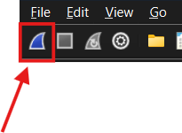
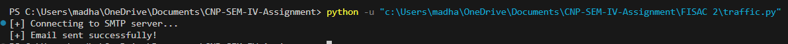
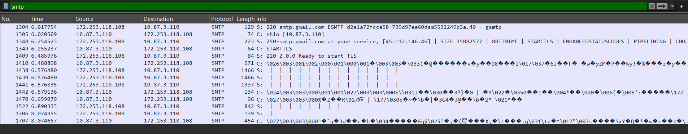

# CNP-SEM-IV-Assignment FISAC-2
> Wireshark bullshitery

### `Files to submit`
- the pcap file (zipped ?)
- writeup (PDF with file name as group number_protocol-name)

# `Writeup`

## Generating and capturing SMTP protocol packets

To generate SMTP traffic, we wrote a barebones <a href="traffic.py">python script</a> to use gmail's smtp server to directly send mail without encrypting it. \
Normally sending a mail on gmail wouldn't work because since it uses TLS/SSL \
the packets are encrypted, wireshark can't capture and filter it out, because it can't see the SMTP commands.   
To capture : 
- turn on capture on wireshark 

- While it's capturing run the python script.

- Once email has been sent turn off the capture.
- now apply the filter `smtp` in the filter bar to view the filtered smtp traffic sent
