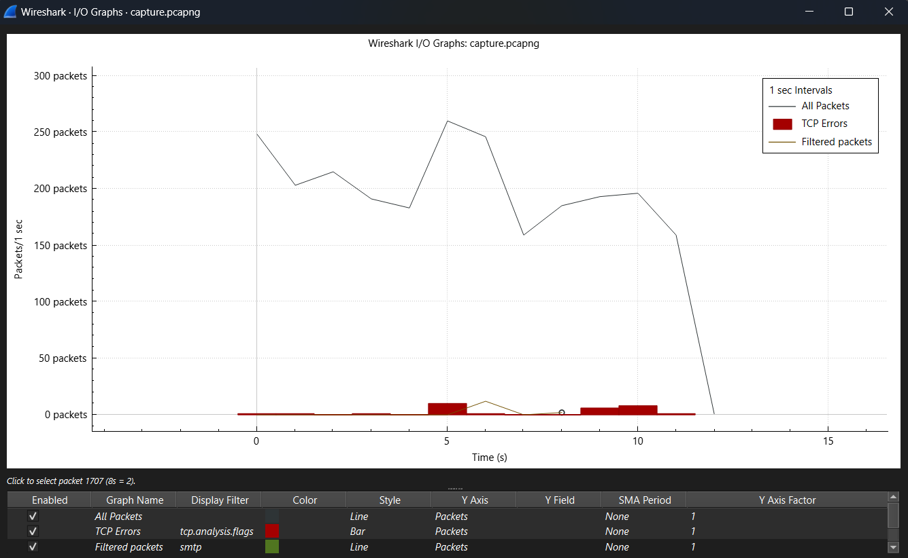

# CNP-SEM-IV-Assignment FISAC-2
> Wireshark bullshitery

### `Files to submit`
- the pcap file (zipped ?)
- writeup (PDF with file name as group number_protocol-name)

# `Writeup`

## Generating and capturing SMTP protocol packets

To generate SMTP traffic, we wrote a barebones <a href="traffic.py">python script</a> to use gmail's smtp server to directly send mail without encrypting it. \
Normally sending a mail on gmail wouldn't work because since it uses TLS/SSL \
the packets are encrypted, wireshark can't capture and filter it out, because it can't see the SMTP commands.   
To capture : 
- turn on capture on wireshark 

- While it's capturing run the python script.

- Once email has been sent turn off the capture.
- now apply the filter `smtp` in the filter bar to view the filtered smtp traffic sent

## brief note on SMTP

SMTP (Simple Mail Transfer Protocol) is a protocol used to send emails across the Internet. It works on port 25 (default) or port 587 (with STARTTLS) or 465 (SSL/TLS). SMTP is an application-layer protocol that uses a client-server model, where the email client connects to the SMTP server to deliver messages. SMTP handles email sending, but not retrieval — that’s handled by POP3 or IMAP.

## flow Graph

Analysing the graph we can notice :
- a maximum of 260 packets was sent at 5 secs from capturing.
- the traffic started at time 0 and ended at time 15s.

## Protocol Hierarchy

Explaination : (ye thoda better kar lena koi)
(also explain length of the packet, header size in each layer, data size etc. most is given in the image)
- A total of 7079 bytes were captured to being transferred out of which 6791 (95.9%) were SMTP packets
- bitrate across the entire capture was 27 kbps
- There was next to no packet loss

## Structure of Wireshark

- Display filter : in the top left there exists the display filter, allows you to filter out packets according to their protocol or other paramters like size, time range etc if specified as such.
- In the centre region you can see the general traffic along with the source ip, destination ip, protocol of the packets being transferred.
- In the bottom left there are the frame details, that allow you to see the flags, overheads, source, destination, protocol, frame size and other related information about the packet.
- In the bottom right you see the raw byte data inside the packet as a hexdump.
- Also there is the top bar with the buttons to start and stop capturing, opening pcap files, analyse etc.

(whoever writes this section draw a rough sketch and make arrows pointing the section to the explaination pls)